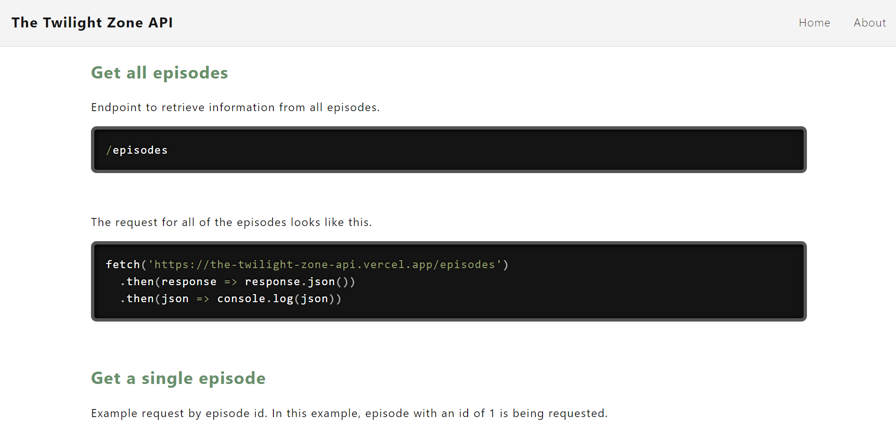

# The Twilight Zone API

## Description

The Twilight Zone API allows you to make HTTP requests on the original Twilight Zone television series. This site was created for the documentation of this custom API and provides all of the information needed to start making HTTP requests, including a set of six common resources that the API comes with.

## The Twilight Zone API Live Link

Please check out the live link for The Twilight Zone API documentation site here: [The Twilight Zone API](https://thetwilightzoneapi.netlify.app/ "The Twilight Zone API")

## Table of Contents
* [Technologies Used](#Technologies-Used)
* [Development](#Development)
* [Screenshots](#Screenshots)

## Technologies Used

* React
* The Twilight Zone custom-built API
* Prism
* CSS (CSS Modules)
* Flexbox
* React Helmet
* Smoothscroll Polyfill
* Facebook Developer Tools (Sharing Debugger)
* Netlify

## Development

In terms of developing the application, I decided to build the app using React and CSS Modules. I decided to use pure CSS, instead of using frameworks, and to use Flexbox and media queries to create an application that would be responsive on both desktop and mobile devices. I began with the functionality of the app (e.g., fetching the data, displaying the data, nominating a movie, etc.), only adding some basic styling as needed in the beginning. As I continued to get more of the functionality working, I moved more and more to the layout and the styling. As I completed the functionality, I focused more on the styles and details of the design, including working on making it responsive across various screen sizes, which I achieved by using Flexbox, media queries, and the Responsively App.

## Screenshots

