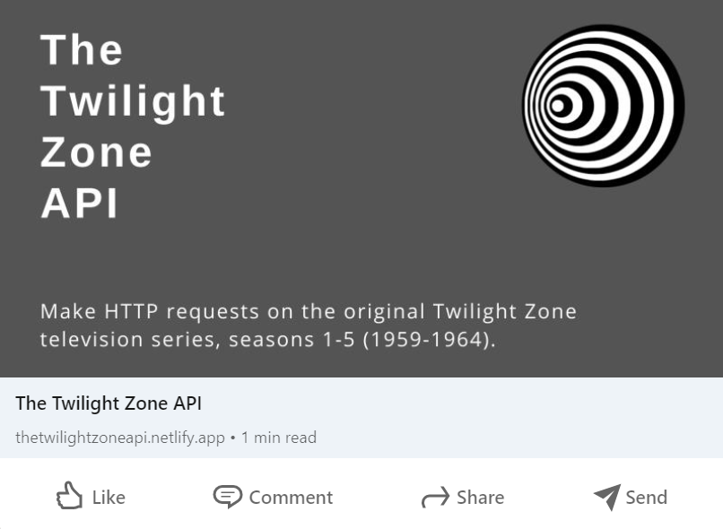

# The Twilight Zone API


## Description

The Twilight Zone API allows you to make HTTP requests on the original Twilight Zone television series. This site was created for the documentation of this custom API and provides all of the information needed to start making HTTP requests, including a set of six common resources that the API comes with.

## The Twilight Zone API Live Link

Please check out the live link for The Twilight Zone API documentation site here: [The Twilight Zone API](https://thetwilightzoneapi.netlify.app/ "The Twilight Zone API")

## API Link

Please go to the API documentation here: [The Twilight Zone API Documentation](https://github.com/answebdev/twilight-zone-api/ "The Twilight Zone API Documentation")

## Table of Contents
* [Technologies Used](#Technologies-Used)
* [Development](#Development)
  - [API Development](#API-Development)
  - [Site Development](#Site-Development)
* [Screenshots](#Screenshots)

## Technologies Used

* React
* The Twilight Zone custom-built API
* Prism
* CSS (CSS Modules)
* Flexbox
* React Helmet
* Smoothscroll Polyfill
* Responsively App
* Facebook Developer Tools (Sharing Debugger)
* Netlify
* Express Server (for API)
* Cors (for API)
* Express Rate Limit (for API)
* Vercel (for API)

[Back To Top](#Table-of-Contents)

## Development

The Twilight Zone API was developed in two phases: API Development and Site Development. In the API Development phase, the actual Twilight Zone API was built, deployed, and tested. In the Site Development phase, the React site was created for the documentation of the API. Details of each phase are described below.

### API Development

To build the [API](https://github.com/answebdev/twilight-zone-api/ "The Twilight Zone API Documentation"), an Express server was created to serve the data and then deploy the data endpoints using Vercel. A JSON file was initially created for all of the data (all five seasons: episodes, air date, images, etc.). In order to create different endpoints for the API (a different endpoint for each season and one for all the episodes), I created separate `.js` files for each of the endpoints and their data (i.e., `episodes.js` contained the data for all of the episodes, `season1.js` contained all of the data for Season 1, etc.) and put them in a folder called `endpoints`. I then created separate routes for each of the endpoints, including dynamic routing in the cases of getting data by a particular `id`, for example (see example code below). These were then brought in and used in the server file (`index.js`). In addition, a `base.html` page with the ('/') endpoint was created for the base URL page containing the API's resources. A route was also created for this in the 'routes' folder, and was also brought in to use in the server file (`index.js`).

```
const router = require('express').Router();
const episodes = require('../endpoints/episodes');

// Get all episodes
router.get('/', async (req, res) => {
  try {
    res.json(episodes);
  } catch (error) {
    console.log(error);
    return res.status(500).send('Server error');
  }
});

// Get by episode id
router.get(`/:id`, (req, res) => {
  let items = episodes;
  let data = items.find((item) => item.id == req.params.id);
  res.json(data);
});

module.exports = router;
```

In addition, Express Rate Limit was used to set a rate limit of 10,000 requests. The rate limiting was tested using Postman, including using the Postman test runner and setting the iteration to 10001, one request over the limit, which at that point returned a status of 429, indicating that the rate limiting was working as expected. To test the endpoints, I used Postman and Paw Cloud, and also created a simple site in order to test each of the endpoints by first fetching, and then displaying the data from the API in the browser:


### Site Development

This site was created for the documentation of the custom-built Twilight Zone API and provides all of the information needed to start making HTTP requests, including a set of six common resources that the API comes with. It was built with React and uses Prism for the syntax highlighting. To make the site responsive and mobile-friendly, Flexbox and media queries were used in conjunction with Responsively App. In addition, smoothscroll polyfill was used so that the smooth scroll behavior can be used in browsers that do not support smooth scrolling (e.g., Safari). Finally, after Open Graph meta tags were added, the Facebook Sharing Debugger tool was used to scrape the site so that when the site's URL is posted and shared (e.g., on Facebook), its content will be shown (see last two screenshots below in Screenshots section).

#### Removing the Anchor Link ID Tags and Hashes from the URL

The site's home page has two buttons in the hero section: "Get Started" and "Resources", and they both navigate the user to different sections of the same page. "Get Started" navigates a user to the Documents section of the page, while "Resources" navigates a user to the Resources section of the page. As they are anchor links used to navigate to a different section of the same page, the sections are given the URLs `#docs` and `#resources`, respectively. When a button is clicked to navigate to its respective section of the page, the hash and `id` will show in the URL (e.g., `thetwilightzoneapi.netlify.app/#docs`), which is something I did not want. To address this, I was able to remove the hash and anchor link `id` from the URL, based on a [solution](https://www.finsweet.com/hacks/15/ "Remove anchor link id tag and # on urls within the same page") I had come across, and adapting it to work in my own setting by creating my own component - which I called `handleHashUrl` - in a `utils` folder that I would then be able to use to achieve this.

I started by giving each of the anchor link buttons in `Home.js` a class of `hashed` in order to be able to select them in the function. Clicking on each of these buttons navigates the user to the appropriate section of the page, each containing either the link URL of `#docs` or `#resources`, depending on which button is clicked.

```
<div className={classes.Buttons}>
  <a
    href={'#docs'}
    className={`${classes.GetStarted} ${'hashed'}`}
  >
    Get Started
  </a>

  <a
    href={'#resources'}
    className={`${classes.GetStarted} ${'hashed'}`}
  >
    Resources
  </a>
</div>
```

Back in the `handleHashUrl` component that I created, I began by first converting everything from the original jQuery to JavaScript. I then selected the anchor link buttons with the class of `hashed` and added a `forEach` to loop through them, since I had more than one that I was targeting. A `setTimeout` is needed to give it enough time (in this case, 5 milliseconds) to actually do the anchor scroll before running the `removeHash` function, which is what actually removes the hash from the URL.

```
const handleHashUrl = () => {
  document.addEventListener('DOMContentLoaded', function (event) {
    const menuBtn = document.querySelectorAll('.hashed');
    menuBtn.forEach(function (el) {
      el.addEventListener('click', function () {
        setTimeout(() => {
          removeHash();
        }, 5);
      });
    });
    function removeHash() {
      window.history.replaceState(
        '',
        document.title,
        window.location.origin +
          window.location.pathname +
          window.location.search
      );
    }
  });
};

export default handleHashUrl;
```

Finally, `handleHashUrl` was imported and used in `Home.js`, and this is what worked. And so now, when either of these buttons are clicked to navigate to another section of the page, the hash and anchor link `id` will no longer show in the URL (though you might see it briefly flash in the URL, because of the 5 milliseconds it was given before being removed), which is the desired result.


[Back To Top](#Table-of-Contents)

## Screenshots




[Back To Top](#Table-of-Contents)
